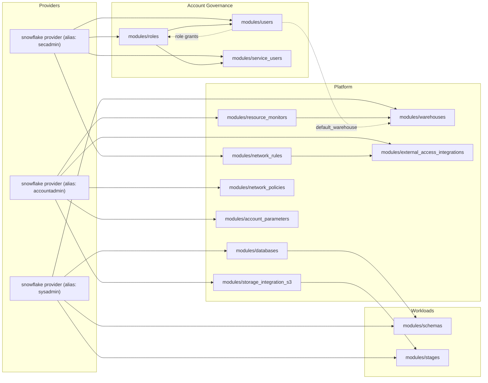

# Snowflake Terraform Stack Library


Infrastructure-as-code templates for managing Snowflake account governance, platform services, and workload resources with Terraform. Comes with a [Snowflake Cortex Code (CoCo) skill](SKILL.md) so an AI agent handles plan generation while humans own `terraform apply`.

## Repository structure

```
live/
  test/                         ← sandbox environment
    account.auto.tfvars         ← connection credentials (never commit real values)
    configs/                    ← one .tfvars per resource type
    account_governance/
    platform/
    workloads/
  prod/                         ← production (mirrors test structure)
modules/                        ← reusable Terraform modules
scripts/                        ← stack-plan.sh, stack-apply.sh, bootstrap.sh
docs/                           ← user guides, architecture, skill guide
references/                     ← stack order, workflow rules, naming conventions, safety guardrails
bootstrap/                      ← first-time environment setup
.cortex/
  skills/                       ← CoCo skills and agents (13 total)
```

Each directory under `live/<env>/...` is a standalone Terraform root with its own state.

## Two ways to work

### Option A — CoCo skill (recommended)

Install the skill once, then describe what you want in plain language:

```bash
# Install (from a CoCo session)
/skill add https://github.com/<you>/snowflake-cortex-iac-agent

# Or symlink locally (see docs/COCO_SKILL_GUIDE.md for full instructions)
ln -sf /path/to/this/repo/.cortex/skills/coco-iac-agent ~/.snowflake/cortex/skills/

# Use
$coco-iac-agent add a new ANALYST user jsmith in test env
$coco-iac-agent onboard a new MARKETING squad with role + warehouse in test
$coco-iac-agent run a drift report across all stacks in test
```

CoCo updates `configs/*.tfvars`, runs `terraform plan`, and explains the diff.
**You run `bash scripts/stack-apply.sh <env> <layer> <resource>` after reviewing.** Never raw `terraform apply` — see [docs/GETTING_STARTED.md](docs/GETTING_STARTED.md) for examples.

### Option B — Manual terminal

Follow the [Execution order](#execution-order) below and run plan/apply yourself.
See [docs/TERRAFORM_COMMANDS.md](docs/TERRAFORM_COMMANDS.md) for a full raw Terraform command reference.

## Architecture



## Prerequisites

- Terraform CLI ≥ 1.5
- Snowflake account with ACCOUNTADMIN, SECURITYADMIN, SYSADMIN privileges
- RSA key pair for JWT auth (see [Setup](#setup))
- SnowSQL on `PATH` — required by the `local-exec` provisioner in `storage_integrations_s3` and `external_access_integrations`
- Snow CLI ≥ 2.x — required for CoCo skill install

## Setup

### 1. Generate a key pair (JWT auth)

```bash
openssl genrsa -out ~/.snowflake/terraform_user_key.pem 2048
openssl pkcs8 -topk8 -inform PEM -outform PEM -in ~/.snowflake/terraform_user_key.pem \
  -out ~/.snowflake/terraform_user_key.p8 -nocrypt
openssl rsa -in ~/.snowflake/terraform_user_key.pem -pubout -out ~/.snowflake/terraform_user_key.pub
```

Attach the public key to your Snowflake provisioning user:
```sql
ALTER USER <USER_NAME> SET RSA_PUBLIC_KEY='<contents of terraform_user_key.pub>';
```

### 2. Configure credentials

Populate `live/<env>/account.auto.tfvars`:

```hcl
organization_name  = "example_org"
account_name       = "example_account"
provisioning_user  = "terraform_user"
private_key_path   = "~/.snowflake/terraform_user_key.p8"
securityadmin_role = "SECURITYADMIN"
sysadmin_role      = "SYSADMIN"
accountadmin_role  = "ACCOUNTADMIN"
query_tag          = "terraform"
snowsql_connection = "your_snowsql_profile"
```

Or use environment variables:
```bash
export SNOWFLAKE_ACCOUNT_NAME="example_account"
export SNOWFLAKE_ORGANIZATION_NAME="example_org"
export SNOWFLAKE_USER="terraform_user"
export TF_VAR_private_key_pem="$(cat ~/.snowflake/terraform_user_key.p8)"
```

### 3. Review configs

Edit `live/<env>/configs/*.tfvars` to match your Snowflake standards before running any stack.

### 4. (Optional) Configure remote state

Each stack has an empty `backend.tf` and a sample config in `backend_tmp/`. To enable:
```bash
cd live/<env>/account_governance/users
terraform init -backend-config backend_tmp/test-account_governance-users.hcl
```
Skip this to keep local state.

## Execution order

Apply stacks in this exact sequence — each depends on the previous. See [`references/stack-mapping.md`](references/stack-mapping.md) for the full dependency table.

```bash
# Plan only:
bash scripts/stack-plan.sh <env> <layer> <stack> --run

# Safe apply (pre-flight checks + mandatory plan + blocks unsafe applies):
bash scripts/stack-apply.sh <env> <layer> <stack>
```

> **Never run raw `terraform apply`.** Missing `-var-file` flags cause empty `for_each` maps → Terraform destroys all resources. `stack-apply.sh` validates config files, detects ForceNew and destroy-only plans, and prompts before every apply.

| Step | Stack | Config file |
|------|-------|-------------|
| 1 | `account_governance/roles` | `create_role.tfvars` |
| 2 | `platform/databases` | `create_database.tfvars` |
| 3 | `account_governance/users` | `create_users.tfvars` |
| 4 | `platform/warehouses` | `create_warehouse.tfvars` |
| 5 | `platform/resource_monitors` | `create_resource_monitor.tfvars` |
| 6 | `platform/storage_integrations_s3` *(SnowSQL)* | `create_storage_integration_s3.tfvars` |
| 7 | `workloads/schemas` | `create_schema.tfvars` |
| 8 | `platform/network_rules` | `create_network_rules.tfvars` |
| 9 | `platform/external_access_integrations` *(SnowSQL)* | `create_external_access_integrations.tfvars` |
| 10 | `workloads/stages` | `create_stage_s3.tfvars` |
| 11 | `platform/network_policies` | `create_network_policies.tfvars` |
| 12 | `platform/account_parameters` | `create_account_parameters.tfvars` |
| 13 | `account_governance/service_users` | `create_service_users.tfvars` |

For day-2 changes, re-apply only the one stack whose config changed.

## SnowSQL escape hatches

Two operations are not supported by the Terraform provider — route to SnowSQL stacks:
- **Database rename** → `live/<env>/platform/database_rename/` (see `RENAMING_LIMITATIONS.md`)
- **External access integrations** → `live/<env>/platform/external_access_integrations/`

## Try it on a free Snowflake trial

1. Sign up for a Snowflake trial and generate a key pair (see [Setup](#setup)).
2. Edit `live/test/account.auto.tfvars` with your trial account details.
3. Run a minimal plan:
   ```bash
   bash scripts/stack-plan.sh test platform databases --run
   ```

## Docs

| File | Purpose |
|------|---------|
| [docs/GETTING_STARTED.md](docs/GETTING_STARTED.md) | CoCo usage guide — 5 workflows with prompt patterns |
| [docs/DAY2_WORKFLOW.md](docs/DAY2_WORKFLOW.md) | End-to-end 8-step workflow for day-2 infrastructure changes |
| [docs/REPO_STRUCTURE.md](docs/REPO_STRUCTURE.md) | Architecture, configs pattern, provider aliases, naming |
| [docs/TERRAFORM_IMPORT.md](docs/TERRAFORM_IMPORT.md) | Adopt an existing Snowflake account into Terraform |
| [docs/TERRAFORM_COMMANDS.md](docs/TERRAFORM_COMMANDS.md) | Raw Terraform command reference — plan, apply, drift detection, ForceNew scan, state inspection |
| [references/stack-mapping.md](references/stack-mapping.md) | Execution order, provider aliases, env naming |
| [references/hcl-patterns.md](references/hcl-patterns.md) | Copy-paste HCL blocks for every resource type |
| [scripts/stack-plan.sh](scripts/stack-plan.sh) | Safe plan for one stack — pre-flight checks, `--run` to execute, `--drift` for exit code detection |
| [scripts/stack-apply.sh](scripts/stack-apply.sh) | Safe apply for one stack — pre-flight checks, mandatory plan, blocks ForceNew/destroy-only, prompts before apply |
| [scripts/apply-changes.sh](scripts/apply-changes.sh) | Multi-stack apply with plan, ForceNew scan, Snow CLI validation, and change summary |
| [scripts/scan-forcenew.sh](scripts/scan-forcenew.sh) | Scan a saved plan output file for ForceNew replacement risks |
| [docs/COCO_SKILL_GUIDE.md](docs/COCO_SKILL_GUIDE.md) | How to build CoCo skills and agents — structure, format, routing pattern, install |

## Troubleshooting

- Auth failures: verify PEM path with `snowsql -a <account> -u <user>`
- SnowSQL not found: install and ensure it is on `PATH`
- `# forces replacement` on a database, warehouse, or role: **stop** — review before applying
- Remote state issues: confirm S3 bucket and IAM permissions before re-running `terraform init`
- Debug provider issues: `TF_LOG=DEBUG terraform plan ...`

## License

Licensed under the Apache License, Version 2.0. See `LICENSE` for details.
