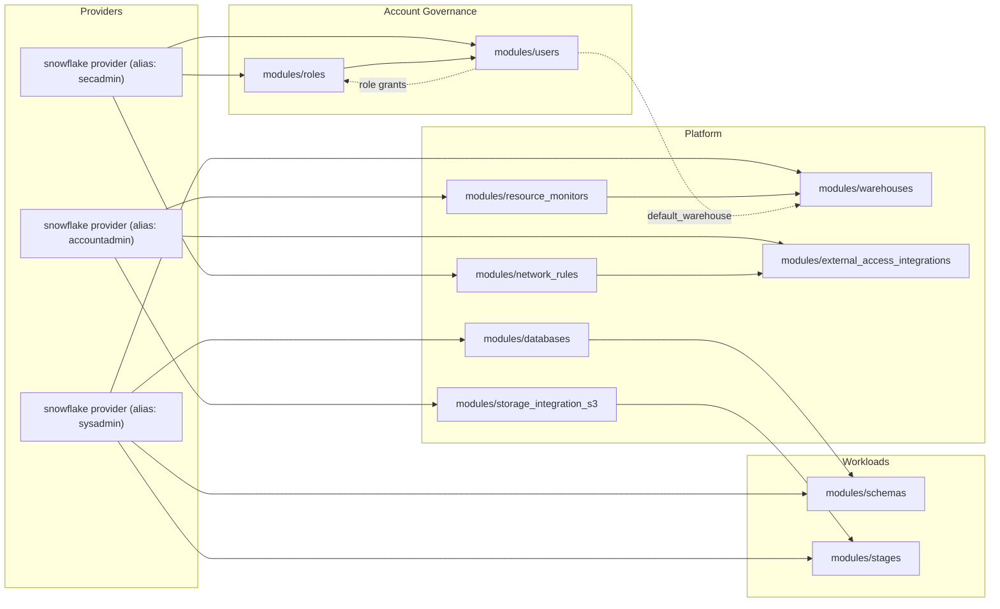

# Architecture — Provider & Module Dependencies

```mermaid
flowchart LR
  %% Provider alias → module ownership and key cross-stack dependencies

  subgraph Providers
    SecAdmin["snowflake provider (alias: secadmin)"]
    SysAdmin["snowflake provider (alias: sysadmin)"]
    AccountAdmin["snowflake provider (alias: accountadmin)"]
  end

  subgraph Account_Governance["Account Governance"]
    Roles["modules/roles"]
    Users["modules/users"]
  end

  subgraph Platform
    Databases["modules/databases"]
    Warehouses["modules/warehouses"]
    ResourceMonitors["modules/resource_monitors"]
    StorageInt["modules/storage_integration_s3"]
    NetworkRules["modules/network_rules"]
    ExternalAccess["modules/external_access_integrations"]
  end

  subgraph Workloads
    Schemas["modules/schemas"]
    Stages["modules/stages"]
  end

  %% Provider alias → stacks
  SecAdmin --> Roles
  SecAdmin --> Users
  SecAdmin --> NetworkRules

  SysAdmin --> Databases
  SysAdmin --> Warehouses
  SysAdmin --> Schemas
  SysAdmin --> Stages

  AccountAdmin --> ResourceMonitors
  AccountAdmin --> StorageInt
  AccountAdmin --> ExternalAccess

  %% Cross-stack dependencies (by stable Snowflake object name, not TF resource ID)
  Roles --> Users
  Databases --> Schemas
  StorageInt --> Stages
  ResourceMonitors --> Warehouses
  NetworkRules --> ExternalAccess

  %% Soft references (by name in tfvars, not Terraform outputs)
  Users -. default_warehouse .-> Warehouses
  Users -. role grants .-> Roles
```
